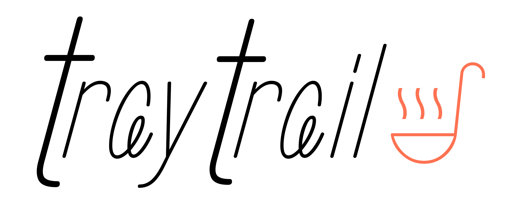

  

A beautiful, modern food tracking and menu management application built with Flutter and Material Design 3.

## 📱 About

TrayTrail is an elegant food tracking and menu management application that helps users discover, vote on, and manage food options. Built with Flutter using Material Design 3 principles, it offers a beautiful and intuitive user experience across all platforms.

## ✨ Features

- **🎨 Material Design 3**: Modern, adaptive UI with dynamic theming
- **🌙 Dark/Light Mode**: Automatic theme switching with system preferences
- **🏠 Home Dashboard**: Quick actions and recent activity overview
- **🍽️ Menu Management**: Browse and manage food menus
- **🗳️ Polls & Voting**: Democratic food selection system
- **📱 Responsive Design**: Works seamlessly on phones, tablets, and desktop
- **🎯 Clean Architecture**: Feature-based organization for maintainable code

## 📱 Platform Support

- ✅ **Android** (API 21+)
- ✅ **iOS** (iOS 12+)
- ✅ **Web** (Modern browsers)
- ✅ **macOS** (macOS 10.14+)
- ✅ **Windows** (Windows 10+)
- ✅ **Linux** (GTK 3.0+)

## 🎯 Roadmap

### Phase 1: Core Features ✨
- [x] Material Design 3 implementation
- [x] Navigation and theming
- [x] Basic home dashboard
- [x] Menu browsing interface
- [ ] Voting/polling system

### Phase 2: Enhanced Features 🚀
- [ ] User authentication
- [ ] Real-time updates
- [ ] Push notifications

### Phase 3: Advanced Features 💫
- [ ] AI-powered recommendations
- [ ] Analytics dashboard

## 📄 License
This project uses a derivative license based on the [PolyForm Strict License 1.0.0](https://polyformproject.org/licenses/strict/1.0.0/), with additional exceptions for authorized usage.
  
The full license text and exceptions are detailed in [LICENSE.md](LICENSE.md).

## 🙏 Acknowledgments

- **Material Design 3** for the beautiful design system
- **Flutter Team** for the amazing framework
- **Font Awesome** and **Material Symbols** for iconography
- **Epilogue**, **Roboto**, and **Zen Loop** font families
---

  <em>Made with Flutter</em>
    
  <strong>© 2025 Daksh Shrivastav. All rights reserved.</strong>

